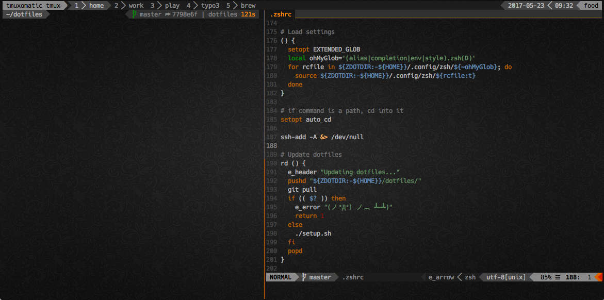

dotfiles
========
My dotfiles `¯\_(ツ)_/¯`. I've tried to use as much native zsh code and as few dependencies as possible. This keeps this setup snappy.

* Vim is powered by [Plug](https://github.com/junegunn/vim-plug)
* Zsh is powered by [zgen](https://github.com/tarjoilija/zgen.git). In the .zlogin you will find some good bits from [Zim](https://github.com/eriner/zim).
* Tmux bar code is generated by [TmuxLine.vim](https://github.com/edkolev/tmuxline.vim)

This setup will work on both OSX and Linux (and may work on other platforms).



## Requirements
* You have `zsh` installed
* You have `tmux` installed (`2.1`+ or you will have issues with the supplied `.tmux.conf` )
* You have `vim` installed (optionally compiled with `ruby` and `python` support)
* You have `ruby`, `ruby-devel`, `python` and `python-pip` installed - if you wish to use Command-T plugin in vim
* You will need a [Powerline capable font](https://github.com/powerline/fonts)
* `Exuberant Ctags`, as TagBar will not work with GNU ctags. On OSX: `brew install ctags` fail.

## Installation
```
git clone https://github.com/tuurlijk/dotfiles "${ZDOTDIR:-$HOME}/dotfiles"
cd "${ZDOTDIR:-$HOME}/dotfiles"
./setup.sh

chsh -s /bin/zsh
```

The installer will also install `zgen` for you.

## Troubleshooting
It might be the case that the `Command-T` vim plugin causes a segfault on your system when you use the bootstrap script.
This is due to the fact that it was compiled for a different architecture than your vim.
See the [Command-T manual](http://git.wincent.com/command-t.git/blob_plain/HEAD:/doc/command-t.txt) for instructions.

Specifically:

```
 First you have to check the platform Vim was built for:

  vim --version
  ...
  Compilation: gcc ... -arch i386 ...
  ...

and make sure you use the correct ARCHFLAGS during compilation:

  export ARCHFLAGS="-arch i386"
  make
```
